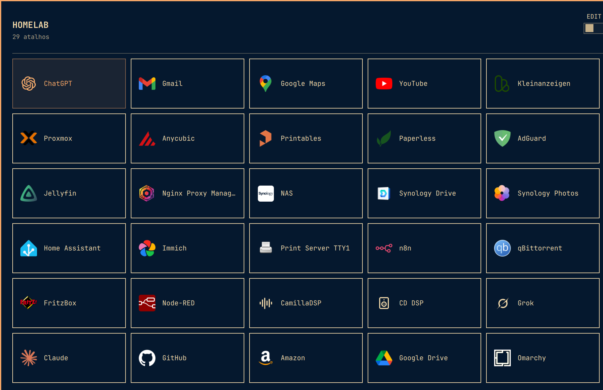

# HomeLab Launcher for Omarchy

A fast, keyboard-first home for everything you host and visit. HomeLab Launcher turns `Super + Y` into a clean command center for servers, dashboards, tools, and favorite links — styled automatically by the active Omarchy theme.



Keep the services you use every day one keystroke away. Search instantly, navigate without leaving the keyboard, and switch into edit mode whenever you want to add, remove, or rearrange a shortcut. Personal links live outside the plugin checkout, so updates never replace your setup.

## Features

- Native Omarchy colors, typography, borders, and controls
- Compact five-column layout with stable card sizing while searching
- Keyboard navigation with arrow keys, `h/j/k/l`, and `Tab`
- Instant search by typing or pressing `/`
- Add, edit, remove, and drag-to-reorder shortcuts
- HTTP and HTTPS shortcut addresses with validation before opening
- SVG and PNG icons from absolute paths or the plugin's `assets/` directory
- Validated icons copied to `~/.config/omarchy/homelab-launcher/icons/`
- Personal data stored in `~/.config/omarchy/homelab-launcher/services.json`

## Install

```bash
omarchy plugin add https://github.com/Elvis-Christian/omarchy-homelab-launcher.git --enable
```

Add a keybinding to `~/.config/hypr/bindings.lua`:

`Super + Y` is a particularly nice fit on German keyboards — easy to reach, with no layout gymnastics.

```lua
o.bind("SUPER + Y", "HomeLab launcher", "omarchy-shell shell toggle io.github.elvis-christian.homelab-launcher")
```

If `SUPER + Y` is already bound, unbind it immediately before the new binding:

```lua
hl.unbind("SUPER + Y")
```

Apply and validate the Hyprland configuration:

```bash
hyprctl reload
hyprctl configerrors
```

## Use

- `Super + Y`: open or close
- Arrow keys or `h/j/k/l`: navigate
- `Tab` / `Shift + Tab`: next or previous item
- `Enter`, `Space`, or click: open
- `/` or normal typing: search
- `Esc`: clear search, then close
- `EDIT` switch: add, remove, or reorder links

The Omarchy card is shown only when needed to complete the unfiltered grid.

## Update

```bash
omarchy plugin update io.github.elvis-christian.homelab-launcher
```

## Remove

Remove the `SUPER + Y` binding from `~/.config/hypr/bindings.lua`, then run:

```bash
omarchy plugin remove io.github.elvis-christian.homelab-launcher
```

Personal links and imported icons remain in `~/.config/omarchy/homelab-launcher/`. Delete that directory manually only if you also want to remove your launcher data.

## Dependencies and permissions

- Omarchy Quattro with `omarchy-shell`
- Quickshell and Hyprland as provided by Omarchy
- `xdg-open` to launch URLs

The plugin runs unsandboxed as part of `omarchy-shell`. It creates and updates `~/.config/omarchy/homelab-launcher/services.json` and its private `icons/` directory, and opens validated HTTP or HTTPS URLs through `xdg-open`. Icons must be local PNG or SVG files, are validated before use, and copied atomically under a content-derived name. PNG files are limited to 2 MiB and 2048×2048; SVG files are limited to 256 KiB and 1000 elements, and executable, embedded, or external content is rejected. Icon imports have a 10-second deadline. Remote icon URLs are never fetched by `omarchy-shell`. It does not require root privileges, network downloads, install hooks, or additional packages beyond Python as provided by Omarchy.

## Test

```bash
omarchy plugin validate .
python3 -m unittest discover -s tests -v
```

## License

MIT — see [LICENSE](LICENSE).
